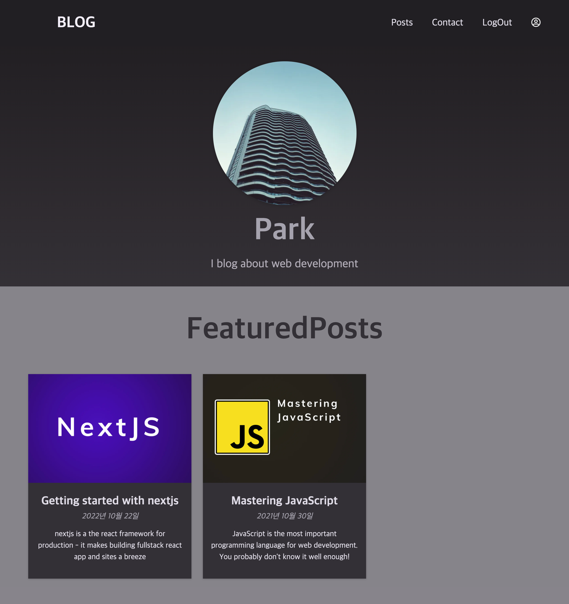
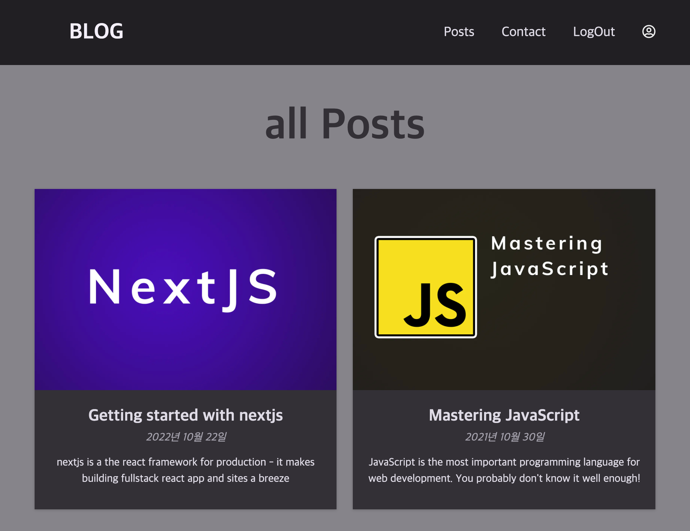

# NextJs를 이용한 웹 블로그

vercel를 이용해 배포 : [web-Blog](https://web-blog-sigma.vercel.app/)

## 블로그 기능

| 페이지         |                                         설명                                         |
| -------------- | :----------------------------------------------------------------------------------: |
| Post           |                 ReactMarkdown을 통해 md파일로 게시글을 구현했습니다.                 |
| Contact        |          mongoDB와 연결하여 접속자가 보낸 문의를 데이터베이스에 저장합니다.          |
| Login & Logout | nextAuth를 이용해 데이터베이스와 연동하여 로그인,회원가입,로그아웃을 할 수 있습니다. |
| Profile        |                  비밀번호 변경,계좌를 지울 수 있는 기능이 있습니다.                  |

## 페이지 화면

HomePage
{:width='300' height='300'}

Post

